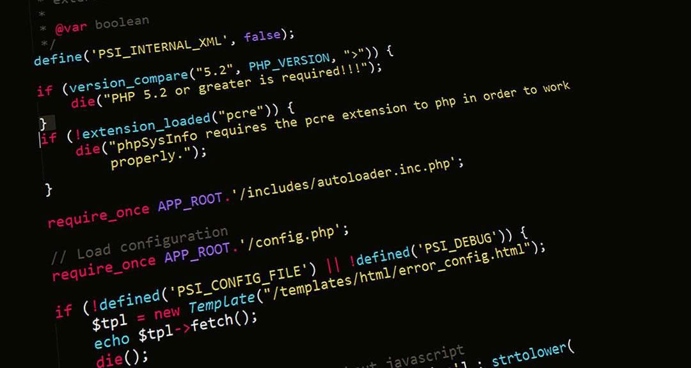

# Jhoan Camilo Charry Perez :wave:
*tecnico en analisis y desarrollo de software*

Soy un programador de software altamente motivado y apasionado por la creación de soluciones innovadoras con experiencia en diseño y mantenimiento de sistemas basicos. Dominio de varias plataformas en especial HTML, JavaScript, CSS y PHP. Buena habilidad para colaborar dentro de un equipo productivo, proactivo, autodidacta y tengo un enfoque orientado a resultados en todas las etapas del ciclo de desarrollo de software.

## Destrezas
- [X] Pseudocodigo
- [x] HTML
- [X] CSS
- [X] JavaScript
- [X] PHP
- [X] Pythom
- [X] Base de Datos MySQL
      
## Idiomas
+  *Español:* lengua natal 
+  *Ingles:* A2 (En proceso de aprendizaje)

## Estudios y certificaciones
+ *Bachiller* Instutucion Educativa Promocion Social (Neiva-Huila)
+ *Tecnico en Analisis y Desarrollo de Software*Sena ADSO

## Estudios en proceso
+ *Tegnologo en Analisis y Desarrollo de Software*Sena ADSO

## Detalles Personales
+ *Nombre:* Jhoan Camilo Charry Perez
+ *Direccion:* <a href="https://es.wikipedia.org/wiki/Neiva">Neiva-Huila</a>
+ *Telefono:* +57 3222329208
+ *Correo:* cachape64@gmail.com 
